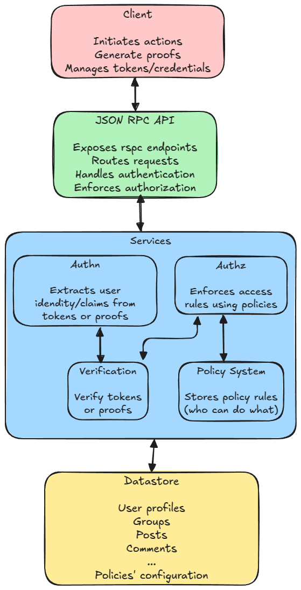

# High-Level Technical Design Document

## Overview

The forum is a self hostable, modular and secure backend and frontend application that supports **authenticated anomymous** interactions.\
It implements fine-grained access control using a policy-based system.

### Key Features

- Authentication (Authn): "you are a user that meets some requirements" (owns a particular email address, or pass another kind of verification)
- Authorization (Authz): "Based on your authentication, you are allowed to do something" (can create a post, can join a group, can delete a post)
- Modular verification layer (JWT, ZKP, Verifiable Credential...).
- Policy-based access control.
- Groups management
- LateX and Markdown support

## Functional Requirements

- User authentication and session management (JWT).
- Authorization middleware for role-based and group-based access control.
- Support for unauthenticated, authenticated, and anonymous-authenticated interactions.
- Cryptographic verification layer for JWTs, ZKPs, and VCs.
- CRUD operations for users, posts, comments, and groups.
- Modular policy system to define access rules dynamically.
- Efficient querying for related data (e.g., fetching posts within a group).
- Users should be able to interact with the forum without compromising anonymity.
- E.g ZKPs allows for actions without revealing the user's full identity.

## Suggested/In Progress Implementation

## Diagram

## Technology Stack

### DB

[Postgres](https://www.postgresql.org/) with heavy use of psql triggers ([ex](https://github.com/privacy-scaling-explorations/pse-forums/blob/main/apps/server/db/migrations/8_handle_new_user_and_group/migration.sql)).

### Backend

- Runtime: [Rust](https://www.rust-lang.org/)
- ORM: [prisma-client-rust](https://github.com/Brendonovich/prisma-client-rust)
- Web Framework: [rspc](https://rspc.dev), [axum](https://github.com/tokio-rs/axum)
- Validation: [validator](https://github.com/Keats/validator), [nutype](https://github.com/greyblake/nutype)
- Mailer library: [lettre](https://github.com/lettre/lettre)
- Cryptography:
  - JWT: [jsonwebtoken](https://github.com/Keats/jsonwebtoken)
  - password hashing/salting: [ring](https://github.com/briansmith/ring)
  - ZK:
    - semaphore: [semapore-rs-backend](https://github.com/adria0/semaphore-rs-backend)
- monitoring: [grafana loki](https://grafana.com/oss/loki/)

### Frontend

- Runtime: [Bun](https://bun.sh/)
- Build Tool: [Vite](https://vitejs.dev/)
- Routing: [tanstack/react-router](https://tanstack.com/router/latest)
- Form validation: [tanstack/react-form](https://tanstack.com/form/latest)
- State management: [jotai](https://jotai.org/)
- Styling: [shadcn](https://ui.shadcn.com/), [tailwind](https://tailwindcss.com/)
